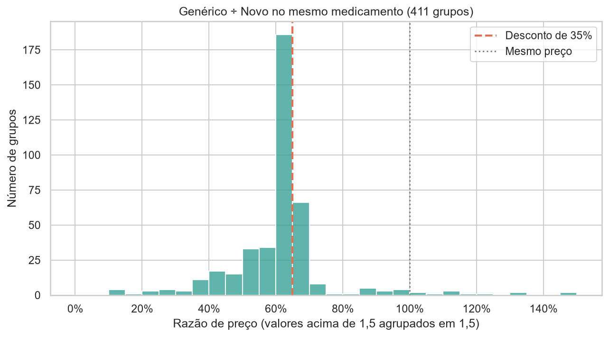
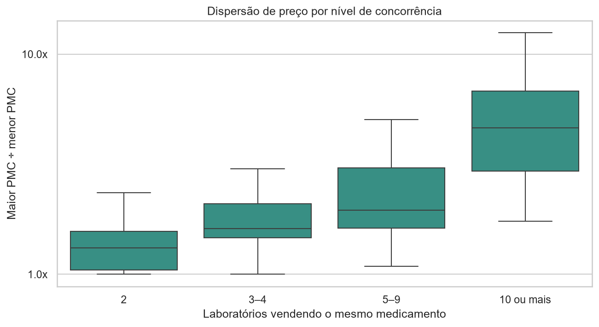
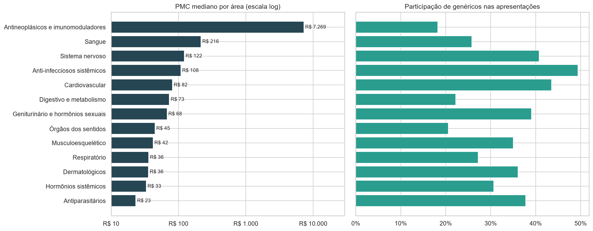
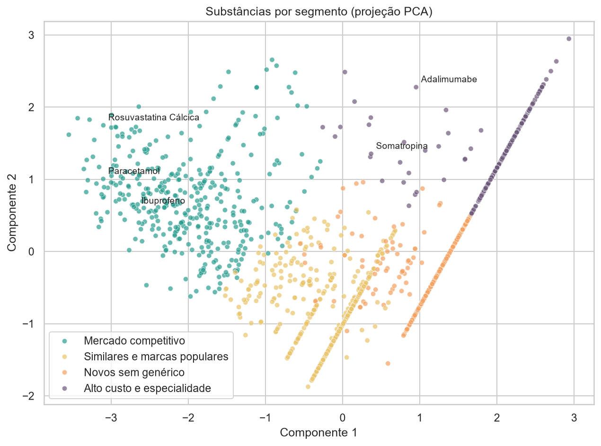
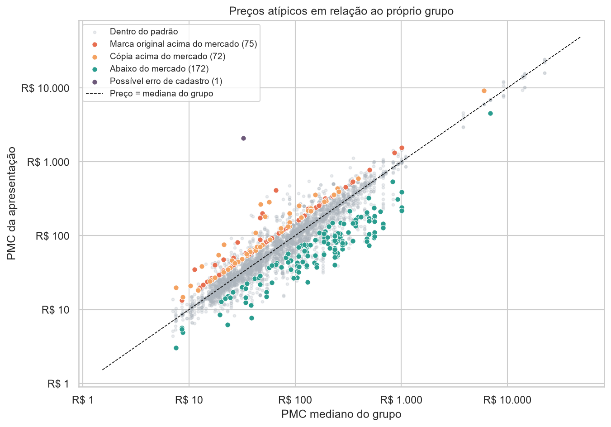

# 💊 Preços de medicamentos no Brasil

Análise dos preços máximos de medicamentos regulados pela CMED/ANVISA:
quanto genéricos e similares custam em relação aos medicamentos novos
equivalentes, e o que explica as diferenças de preço.

## Principais resultados

**Genéricos custam, em mediana, 35% menos que o medicamento novo equivalente**,
e são mais baratos em 97% dos 411 grupos comparados. A maioria fica
exatamente no desconto mínimo exigido pela regulação da CMED.

**Mais concorrência gera mais dispersão de preço.** Com 10 ou mais laboratórios
vendendo o mesmo medicamento, o preço máximo mais alto chega a ser 4,6 vezes
o mais baixo (mediana), contra 1,3 vez quando há só 2 concorrentes.

**Oncologia e imunologia concentram os preços mais altos**, com PMC mediano
de R$ 7.269 e apenas 18% de genéricos.

**Quatro perfis de mercado:** o clustering (K-Means) separou as substâncias em
mercado competitivo, similares e marcas populares, novos sem genérico e
alto custo/especialidade, este com PMC mediano de R$ 9.282.

**Preços atípicos:** um z-score robusto (validado com Isolation Forest) encontrou
320 apresentações com preço fora do padrão do próprio grupo. Todas as marcas
originais marcadas estão acima do mercado, e alguns genéricos cobram exatamente
o teto regulatório (65% da marca), enquanto outros cobram uma fração disso.
A primeira rodada também revelou um erro de agrupamento (embalagens múltiplas),
corrigido no próprio notebook.

## Metodologia

- **Base:** 10.983 apresentações comercializadas e vendidas no varejo
  (lista CMED de 09/09/2026, 1.532 substâncias, 190 laboratórios)
- **Preço:** PMC sem impostos, para eliminar o efeito do ICMS de cada estado
- **Comparação justa:** apresentações agrupadas por substância, dose, forma
  farmacêutica e quantidade; tipos de produto comparados dentro de cada grupo
  pela mediana

**Limitações:** o PMC é um teto regulatório (o preço praticado pode ser menor);
a lista não identifica o medicamento de referência, então "Novo" é usado como
aproximação; o agrupamento por texto pode juntar itens não equivalentes.

## Estrutura

| Notebook | Conteúdo |
|---|---|
| `01_limpeza.ipynb` | Leitura do arquivo bruto, padronização e conversão dos preços |
| `02_eda.ipynb` | Comparação entre tipos de produto, concorrência e áreas terapêuticas |
| `03_clustering.ipynb` | Segmentação de substâncias por perfil de mercado (K-Means) |
| `04_anomalias.ipynb` | Anomalias de preços e ítens localizados na base fornecida pela CMED |

## Como reproduzir

1. Baixe a lista de preços (PMC, XLSX) em
   https://www.gov.br/anvisa/pt-br/assuntos/medicamentos/cmed/precos
   e coloque em `data/raw/`
2. Crie o ambiente e instale as dependências:

       python -m venv .venv
       .venv\Scripts\activate
       pip install -r requirements.txt

3. Execute os notebooks da pasta `notebooks/` em ordem.

## Stack

Python · pandas · matplotlib · seaborn · scikit-learn

---
**Cristian Guedes** · [LinkedIn](https://www.linkedin.com/in/cristiangds/)
